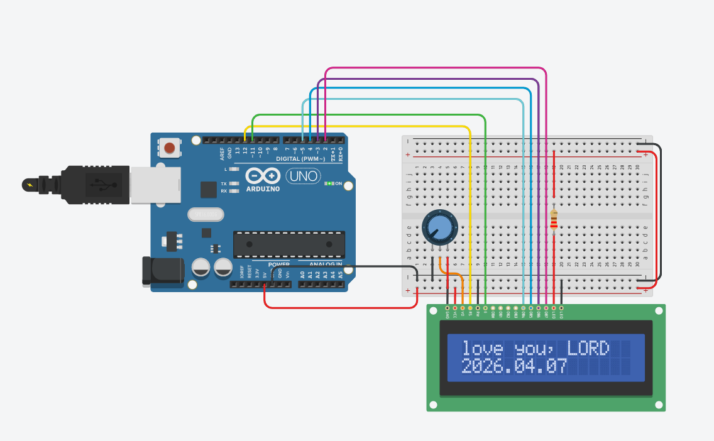

# 📅 2026.04.07 (D-196) 개발일지
## [DevLog] Project: 센서 제어 심화 및 하드웨어 인터페이스 이해

> "단순히 작동하는 코드를 넘어, 하드웨어의 물리적 특성과 연산 효율성을 고민하다."

### 1. 📏 초음파 센서(HC-SR04)와 연산 최적화
* **정밀 제어:** `delayMicroseconds()`를 활용한 10μs 트리거 신호 제어 성공.
* **연산 최적화:** 실수 연산(0.034)을 **정수 연산(`* 17 / 1000`)**으로 대체.
  * **결과:** CPU 부하를 줄여 시리얼 모니터 업데이트 속도를 획기적으로 개선함. 임베디드 환경에서의 효율적인 알고리즘 설계 중요성 체감.

### 2. ⚙️ 서보 모터(Servo Motor)의 물리적 한계 극복
* **안정성 확보:** 180도 근처 기계적 떨림(Stall) 현상 발견.
* **해결:** 소프트웨어적으로 가동 범위를 제한(Safe Range)하여 모터 수명과 안정성 고려.

### 3. 📟 1602 LCD 인터페이스 및 메모리 구조
* **전극 구조 파악:** 백라이트 단자(A, K) 전극 및 보호 저항 배치 숙달.
* **메모리 체계 이해:** LCD 내부 DDRAM 구조 파악. 16열 초과 시 글자 잘림 현상을 해결하기 위한 `setCursor()` 및 `scroll` 함수 활용 필요성 정립.

### 📸 구현 회로도

🖼️ LCD & 센서 제어 회로도 보기 (클릭)

 
*초음파 센서 및 LCD 인터페이스 배선도*

### 💡 오늘의 깨달음
"컴퓨터의 눈높이에서 생각하기." 소수점 계산 하나가 MCU에 주는 부담을 직접 확인하며, 하드웨어의 물리적 한계를 인정하고 그 안에서 최선을 만들어내는 엔지니어의 역할을 배움.
