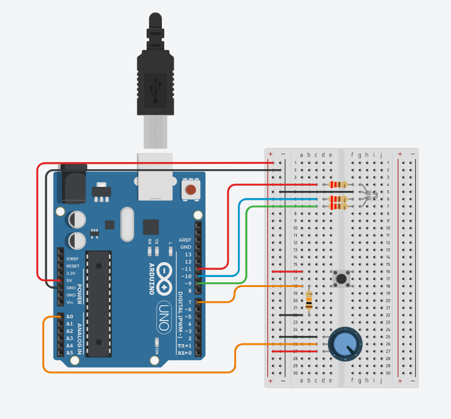

Arduino_in_army
군대에서 꿈을 향해 나아가는 청년의 기록 Arduino, C++, IoT, RGB LED

<details>
<summary>📅 2026.03.31 - 04.02 (D-201) 개발일지 (클릭해서 보기)</summary>

[📝 [DevLog] Project: 3색 LED & 가변저항 제어 구현기
📅 기간: 2026.03.31 - 04.02 (3일간의 집중 구현)

<details>
<summary>📸 3일간의 사투가 담긴 회로도 보기 (클릭)</summary>

 
*팅커캐드로 구현한 스위치 및 가변저항 제어 회로도입니다.*

</summary>
</details>

"기초가 흔들리면 성은 무너진다. 스위치 하나, 변수 하나라도 완벽히 제어할 수 있을 때까지 반복했습니다."

🎯 구현 목표: "하드웨어 제어의 완전한 숙지"
단순히 LED를 켜는 것을 넘어, **입력(Switch/Potentiometer)**과 **상태 관리(State Management)**의 메커니즘을 완벽히 이해하는 것을 목표로 했습니다.

🛠 3일간의 집요한 사투 (Focus: Switch Logic)
스위치를 이용한 상태 제어(color 값 변경) 로직이 처음에는 익숙하지 않아 3일 내내 코드를 뜯어보며 반복 숙달했습니다.

Switch Debouncing & State Change: * 스위치를 눌렀을 때 값이 튀는 현상이나, 한 번 눌렀을 때 color 값이 의도치 않게 여러 번 변하는 문제를 해결하기 위해 조건문 구조를 반복해서 설계했습니다.

핵심 성과: if(color == 0)과 같은 상태 체크 로직과 color++를 이용한 상태 순환(Cycle) 원리를 완전히 내 것으로 만들었습니다.

Logic Error와의 전쟁:

if(color = 0)과 같은 치명적인 대입 연산자 실수를 발견하고, 왜 로직이 꼬이는지 3일간의 반복 테스트를 통해 원리를 파악했습니다. 이제는 눈으로만 봐도 로직의 흐름이 읽힐 정도로 숙련되었습니다.

Data Mapping (Potentiometer):

가변저항의 아날로그 값(0~1023)을 LED 출력값(0~255)으로 변환하는 map 함수의 데이터 흐름을 정립했습니다.

R_value = pot;과 같은 데이터 대입 방향의 중요성을 깨닫고, 입력값이 출력으로 이어지는 파이프라인을 정확히 구축했습니다.

💡 3일의 시간이 준 깨달음 (Key Takeaways)
"안다고 착각하는 것과 할 줄 아는 것은 다르다": 스위치 코드 한 줄을 완벽히 제어하기 위해 보낸 3일이, 앞으로 복잡한 시스템을 설계할 때 가장 튼튼한 뿌리가 될 것임을 확신합니다.

하드웨어 디버깅의 끈기: 쇼트 현상부터 코드 오타까지 하나하나 잡아내며, 인제 사지방의 제한된 환경에서도 포기하지 않는 끈기를 배웠습니다.]

</details>

<details>
<summary>📌 📝 [DevLog] Project: 센서 제어 심화 및 하드웨어 인터페이스 이해
📅 날짜: 2026.04.07 </summary>


"단순히 작동하는 코드를 넘어, 하드웨어의 물리적 특성과 연산 효율성을 고민하다."

1. 📏 초음파 센서(HC-SR04)와 연산 최적화
Microseconds 제어: 초음파 발생을 위해 delay()가 아닌 delayMicroseconds()를 사용하여 10μs의 정밀한 트리거 신호를 제어함.

정수 연산 vs 부동 소수점: * 0.034와 같은 실수 연산 시 CPU 부하로 인해 시리얼 모니터 업데이트가 느려지는 현상을 발견.

이를 정수 연산(* 17 / 1000)으로 대체하여 시스템 처리 속도를 획기적으로 개선함. 임베디드 환경에서 연산 최적화의 중요성을 체감함.

2. ⚙️ 서보 모터(Servo Motor)의 물리적 한계
회로 및 각도 제어: 표준 서보 모터의 가동 범위가 0~180도임을 확인하고, 내부 가변저항을 통한 위치 피드백 원리를 학습함.

Safe Range 설정: 180도 근처에서 발생하는 기계적 떨림(Stall)을 방지하기 위해 소프트웨어적으로 가동 범위를 제한하여 모터의 수명과 안정성을 고려함.

3. 📟 1602 LCD 인터페이스 및 전극 구조
Anode(+) & Cathode(-): 백라이트 단자인 LED A와 LED K(C)의 전극 구조를 파악하고, 적절한 저항 배치를 통해 하드웨어를 보호하는 배선법을 익힘.

LCD 메모리 구조(DDRAM): * 16열을 초과하는 데이터 입력 시 글자가 잘리는 현상을 통해 LCD 내부의 메모리 주소 체계(1행당 40칸 할당 등)를 이해함.

자동 줄바꿈이 되지 않는 특성을 파악하여 setCursor()와 scroll 함수 활용의 필요성을 정리함.

💡 오늘의 깨달음 (Key Takeaways)
"컴퓨터의 눈높이에서 생각하기": 소수점 계산 하나가 MCU에 얼마나 큰 부담을 주는지 직접 눈으로 확인하며, 효율적인 알고리즘 설계의 중요성을 깨달음.

"하드웨어는 정직하다": 물리적 한계(180도, 16열)를 인정하고 그 안에서 최선의 결과물을 만들어내는 것이 엔지니어의 역할임을 배움.
오늘 배운 초음파 센서와 서보 모터 내용을 여기에 다 넣으면 된단다. 
이미지나 코드 블록(```)도 이 안에 다 들어갈 수 있어!

</details>
